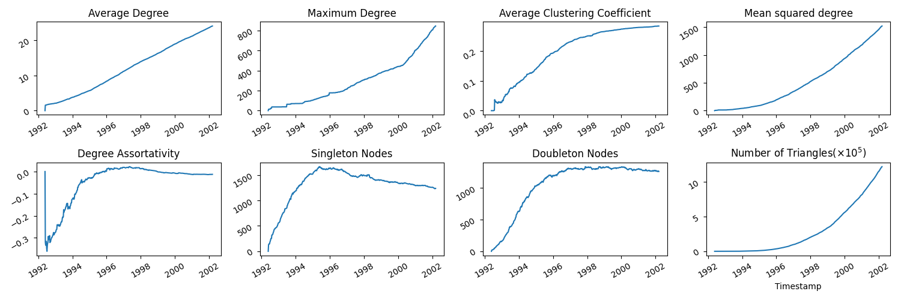

# About
FETA stands for "Framework for Evolving Topology Analysis", and is a multi-purpose java-based software for the analysis of evolving networks and models for their topology,
based on [FETA2](https://github.com/richardclegg/FETA2) by [Richard Clegg](https://github.com/richardclegg).

## What can I use FETA for?

* Obtaining time series of measurements on growing directed and undirected networks
* Growing networks from a range of models and combinations of these
* Fitting models to timestamped network data.

## What can't I use FETA for?

* Networks with disappearing nodes or edges
* Weighted networks/multigraphs

## Changes from FETA2

* Flexibility to specify models which may change over time
* More graph file types supported
* Scripts for configuring now written in JSON rather than XML
* Different types of network growth considered

## Contact

If you have questions, comments, ideas or are having bugs, please don't hesitate to get in touch. Drop me an email at
n.a.arnold@qmul.ac.uk

## Citation

Please cite as:

Arnold, Naomi A., Raul J. Mondragón, and Richard G. Clegg. "Likelihood-based approach to discriminate mixtures of network models that vary in time." _Scientific reports_ 11.1 (2021): 1-13.

# Building and running

## Requirements

This software runs using Java, so if you haven't already, install the latest version [here](https://www.java.com/en/download/). 

The jar file is built using Apache Ant, which can be found [here](https://ant.apache.org/).

Optionally, I have some scripts for gnuplot in the tutorial for plotting - you can find gnuplot [here](http://www.gnuplot.info/)

## Installation

First clone the repository, either manually or using the command: 

```bash
git clone https://github.com/narnolddd/FETA3.git
```

For everything else, jump into the `FETA3` folder if you haven't already:

```bash
cd FETA3
```

## Building

Then run the command:

```bash
ant jar
```

to make the jar file.

## Running

Once you have the jar file, FETA is executed from the command line as:

```bash
java -jar feta3-1.0.0.jar scripts/[some-script-name].json
```

The single argument `scripts/[some-script-name].json` is a JSON config file telling FETA what action to perform. The next section describes how this works.

# Examples

## Obtaining time series of network quantities

Let's do an example of obtaining a time series of measurements from a timestamped network dataset. In the `data` folder there's a file 'cit-HepPh-new.txt'
which is a timestamped citation network dataset from ArXiV high energy physics phenomenology, available from [SNAP](https://snap.stanford.edu/data/). We will 
use the script `MeasureCitations.json` in the `tutorial` folder, which looks like:

```JSON
{
  "Data": {
    "GraphInputFile": "data/cit-HepPh-new.txt",
    "GraphInputType": "NNT",
    "Directed": false
  },
  "Action": {
    "Measure": {
      "Start": 706492800,
      "Interval":604800,
      "MaxNodes": 34343,
      "Statistics": ["NoNodes", "NoLinks", "AverageDegree", "MaxDegree","Singletons","MeanSquaredDegree", "Assortativity", "Clustering", "TriangleCount"],
      "PrintHeader": true,
      "FileName":"tutorial/CitationsTS.dat"
    }
  }
}
```

The `Data` tag tells FETA what type of input to expect:

* The `GraphInputFile` tag specifies the location of the network file to read. Acceptable formats are tab/comma separated edgelists, 
with or without timestamps. 
* `GraphInputType` allows either "NNT" or"NN" - this refers to whether or not the edgelist is timestamped. "NNT" is for edges 
which look like `NODE-1 NODE-2 TIMESTAMP`, "NN" for `NODE-1 NODE-2`. In the latter case, edges will be treated as arriving sequentially. 
* `Directed` refers to whether the edges should be treated as directed or not - default false.

The `Action` tag tells FETA what to do with the inputted file; in this case we want to take measurements of it. We can specify:

* `Start` - time at which FETA will start taking measurements. This takes integers/longs. In this case, the timestamp type is a UNIX timestamp.

* `Interval` - time between measurements. In this case, we specify weekly measurements

* Stopping condition. This can either be a latest time (given as long) `MaxTime`, maximum number of nodes `MaxNodes` or links `MaxLinks`. This specifies
how long the measurements should take place for - in this example the measurements will finish when the network size has reached 34343 nodes,
the complete size of this network dataset.

* `Statistics` - a string vector of the different statistics desired. In this JSON I have listed all available statistics.

* `FileName` - where to write the measurements to. This will also generate one, or two files (depending on whether or not the network
is directed) to store the degree distribution at different snapshots.

In the terminal, run the command 

```bash
java -jar feta3-1.0.0.jar tutorial/MeasureCitations.json
```

It may take a minute or so to run, as the network file is quite big.

You should now have the file `CitationsTS.dat` in the `tutorial` folder. The columns are ordered as: timestamp, number of nodes,
number of links, average degree, density (number of links/number of possible links), maximum degree, average clustering coeff,
mean squared degree, degree assortativity.

To see what these time series look like, you can use your favourite plotting device. Mine happens to be pyplot. To use this you should have pandas instlaled for python3. I have written 
a script for plotting these measurements you've just calculated - run the command:

```bash
python3 tutorial/CitationsTS.py
```

and there should now be an .eps plot in your `tutorial/plots` folder which should look like this:




Whilst these plots are informative, note that we have treated the citation network edgelist as undirected, whereas since citations are always 
*from* one paper to another, it may more naturally be considered a directed network. What happens if we do the same process but treat the 
network as directed? 

We're going to run the same command as before, but with the file `tutorial/MeasureCitationsDirected.json` which looks like:

```JSON
{
  "Data": {
    "GraphInputFile": "data/cit-HepPh-new.txt",
    "GraphInputType": "NNT",
    "Directed": true
  },
  "Action": {
    "Measure": {
      "Start": 706492800,
      "Interval":604800,
      "MaxNodes": 34343,
      "Statistics": ["NoNodes", "NoLinks", "AverageDegree", "MaxDegree","Singletons","MeanSquaredDegree", "Assortativity", "Clustering", "TriangleCount"],
      "PrintHeader": true,
      "FileName":"tutorial/CitationsTSDirected.dat"
    }
  }
}
```

This is identical to the previous file `tutorial/MeasureCitations.json` apart from the `Directed` tag being changed from
`false` to `true`, and a different filename given to print the measurements to.

Let's run the command 

```bash
java -jar feta3-1.0.0.jar tutorial/MeasureCitationsDirected.json
```

Now, notice that some of the measurements which made sense for undirected networks may not make sense or at the very least need some
adaptation for directed networks. For instance, 'average degree' will be split into two measurements of 'average in-degree' and 'average
out-degree'. Also, the clustering coefficient is now ill-defined as the concept of a triangle of nodes in directed networks doesn't make 
much sense now. With this in mind, the columns are ordered as: timestamp, number of nodes, number of links, average in-degree, average 
out-degree (both identical), maximum in-degree, maximum out-degree, mean squared in-degree, mean squared out-degree, and four measures of degree assortativity
(in-in, in-out, out-in, out-out).

Again, to generate some plots, run:

```bash
python3 tutorial/CitationsTSDirected.py
```

which will generate some .eps files in the plots folder. Compare with the plots generated when we treated the network as undirected.


Just for fun, we can plot the in/out/total degree distribution too. Run:

```bash
python3 tutorial/CitationsDegDist.py
```

giving the following plot:


## Working with evolving network models

Whilst taking network measurements of timestamped is certainly one helpful feature of FETA, the main focus of the software is on 
a versatile modelling and model validation framework for evolving networks. For a mathematically detailed description of the framework, see the paper
[Likelihood-based assessment of dynamic networks](https://eprints.soton.ac.uk/397485/1/feta_comnet_2015.pdf) by Richard Clegg, Ben 
Parker and Miguel Rio. For the purpose of using the code, I'll give a basic overview.

Network growth models are specified in two parts. The first is the *Operation Model*, which determines the type of graph transformation
that occurs at each iteration. For example, adding a new node and connecting to 3 existing nodes, such as in the traditional Barabasi-Albert
model. The second part is the *Object Model*. This model takes a network topology (possibly with some metadata) and assigns a probability to
each of the nodes in the network to be chosen. For example, in the Barabasi-Albert model, the probability of a node being chosen is proportional
to its degree. 

### Operation Model

For the operation model, we consider just two very simple types of growth operations which we'll call *external* and *internal stars*.

Either a new node joins the network and connects to a number of (existing or new) nodes as below, which we term an *external star*:

  

Alternatively, an existing node connects to a number of other existing nodes, which we call an *internal star*:

 

The full operation model specifies a sequence of these operations for the network evolution. 

The current choices of Operation Model for the user are:
* `Email` - named as such to mimic email networks, with growth comprising a mixture of internal and external stars. User can specify
`NoRecipients` which is the number of links for each star, and `PropInternal` which specifies the probability that the star stems from
an internal node.
* `PreferentialAttachment` - named after the original Barabasi-Albert paper, with networks growing by addition of a single node connecting 
to a fixed number of existing nodes. User can specify `InitDegree`, the number of nodes each new node should connect to.

### Object Model

The Object Model assigns, at each timestep, attachment probabilities to each of the nodes. The different models currently loaded in
the software are:

* `RandomAttachment` - all nodes equally likely.
* `DegreeModelComponent` ([Barabasi-Albert](http://science.sciencemag.org/content/286/5439/509)) - nodes of higher degree are more attractive
* `DegreeWithAgeing` ([Dorogovtsev-Mendes](https://arxiv.org/pdf/cond-mat/0001419.pdf)) - like the above but older nodes become less 
attractive. Has parameter `AgeingExponent` controlling the effect of node's age on attractiveness.
* `RankPreferentialAttachment` ([Fortunato, Flammini, Menczer](https://arxiv.org/abs/cond-mat/0602081)) - with parameter `Alpha`. Positive
values of alpha lead to oldest nodes being most attractive, vice versa for negative values.
* `DegreePower` [Krapivsky, Redner, Leyvraz](https://arxiv.org/abs/cond-mat/0005139) - nonlinear preferential attachment to node degree.
Parameter `Power` species the degree power.
* `TriangleClosure` - aims to close triangles by nodes picking at random from the neighbourhood of the last l chosen nodes.
* `TriangleClosureDegree` - same as previous, but weighted towards higher degree nodes in this neighbourhood
* `TriangleClosureInverseDegree` - weighted towards lower degree nodes

In addition, the modelling framework allows for flexibility in two ways:

#### Model Mixtures

Firstly, mixtures of object models may be used, for example a model that is 'half BA and half random' to capture multiple factors driving
attachment. 

#### Time varying models

Secondly, models are allowed to vary throughout the time of a network's evolution, for example, growing for the first 1000 timesteps
according to pure random attachment, from 1000-2000 as half-random half-BA, and 2000-3000 pure BA.

### Growing a network from a specified model

One of the capabilities of FETA is to generate networks from the modelling framework described. Let's look at an example growing script 
called `GrowExample1.json`.
For the sake of exhaustiveness, I've made it a bit more complicated than is probably necessary. 

```JSON

{
  "Data": {
    "GraphInputFile": "seed_graphs/loop-5.dat",
    "GraphOutputFile": "tutorial/GrowExample1.dat",
    "GraphInputType": "NNT",
    "GraphOutputType": "NNT",
    "Directed": false
  },
  "Action": {
    "Grow": {
      "Start": 1,
      "Interval": 10,
      "MaxTime": 3000
    }
  },
  "ObjectModel": [
    {
      "Start": 1,
      "End": 1000,
      "Components": [
        {
          "ComponentName": "feta.objectmodels.components.DegreeWithAgeing",
          "Weight": 1.0,
          "AgeingExponent": 0.8
        }
      ]
    },
    {
     "Start": 1000,
      "End": 2000,
      "Components": [
        {
          "ComponentName": "feta.objectmodels.components.RandomAttachment",
          "Weight": 0.5
        },
        {
          "ComponentName": "feta.objectmodels.components.DegreeModelComponent",
          "Weight": 0.5
        }
      ]
    },
    {
      "Start": 2000,
      "End": 3000,
      "Components": [
        {
          "ComponentName": "feta.objectmodels.components.RankPreferentialAttachment",
          "Weight": 1.0,
          "Alpha": 0.6
        }
      ]
    }
  ],
  "OperationModel":
  {
    "Name": "feta.operations.Email",
    "NoRecipients": 3,
    "PropInternal":0.2
  }
}

```

The tag `GraphInputFile` now points to the seed graph with which we want to start - here a file with edgelist comprising a loop of
5 nodes.

Run the command 
```bash
java -jar feta3-1.0.0.jar tutorial/GrowExample1.json
```

Let's get some measurements on the network we've grown. 

Run 

```bash
java -jar feta3-1.0.0.jar tutorial/MeasureArtificial.json
```

and finally plot using:

```bash
python3 tutorial/ArtificialTS.py
```

(You should get something like the below in the `tutorial/plots` folder)


#### Subtleties

The object model must be fully specified for the whole time period that the network is growing. That is, the value for `End` tag on
the last `ObjectModel` must be at least the value for `MaxTime` in `Action`. Similarly, the last value of each subsequent time interval must
be equal to the start of the next (here 1-1000, 1000-2000, 2000-3000).

### Model likelihood

The main feature of the FETA software, along with generating networks, is to calculate likelihoods of network *object models* for a 
timestamped network dataset. Please refer to the [paper](https://eprints.soton.ac.uk/397485/1/feta_comnet_2015.pdf) for an in depth
description, but informally, the value c0 calculated is a rescaling of the log-likelihood ratio of the model proposed against 
pure random/uniform attachment. Then c0 > 1 should be interpreted as a model being more likely than the random attachment model,
c0 < 1 less likely. 

To do a quick example, run:

```bash
java -jar feta3-1.0.0.jar tutorial/CitationsBALikelihood.json
```

Let's look in closer detail at the JSON file:

```json

{
  "Data": {
    "GraphInputFile": "data/cit-HepPh-new.txt",
    "GraphInputType": "NNT",
    "GraphOutputType": "NNT",
    "Directed": false
  },
  "Action": {
    "Likelihood": {
      "Start": 706492800,
      "Interval": 1,
      "MaxNodes": 10000,
      "OrderedData": false
    }
  },
  "ObjectModel": [
    {
      "Start": 706492800,
      "End": 1006492800,
      "Components": [
        {
          "ComponentName": "DegreeModelComponent",
          "Weight": 1.0
        }
      ]
    }
  ]
}
```

We are calculating the likelihood (c0) value of the degree preferential attachment (BA) model for the citation network as 
before, for the network's entire evolution from time `706492800` up to it reaching 10,000 nodes. The likelihood returned 
looks something like this:

```
c0 1.5773221701566862 raw 18497.567340787682 choices 40589
```

The value for `raw` is the log-likelihood of the model, whilst c0 is a value scaled by the number of node choices made
(= `exp(raw/choices)`).

#### Model fitting

Another feature of FETA, following on from being able to calculate individual likelihoods, is to be able to fit a mixed model
to a dataset, identifying the mixture of models which gives the highest likelihood for the dataset. Let's do an example for 
the citations network dataset - see the file `tutorial/CitationsFitMixed.json`:

```JSON
{
  "Data": {
    "GraphInputFile": "data/cit-HepPh-new.txt",
    "GraphInputType": "NNT",
    "GraphOutputType": "NNT",
    "Directed": false
  },
  "Action": {
    "FitMixedModel": {
      "Start": 706492800,
      "Interval": 60400,
      "MaxNodes": 1000,
      "OrderedData": false,
      "Granularity": 100
    }
  },
  "ObjectModel": [
    {
      "Start": 706492800,
      "End": 1006492800,
      "Components": [
        {
          "ComponentName": "DegreeModelComponent"
        },
        {
          "ComponentName": "RandomAttachment"
        },
        {
          "ComponentName": "TriangleClosure",
          "Depth":1
        }
      ]
    }
  ]
}

```

Here we invoke the action `FitMixedModel`, a routine for finding the highest likelihood mixture of the model components chosen,
here degree (BA), random attachment and triangle closure. Granularity refers to how fine-grained a search over all possible model
mixtures (in terms of weights) - here granularity 100 means a search over the parameter space in increments of 0.01 for 
each model component weight. 

Running the command:

```bash
java -jar feta3-1.0.0.jar tutorial/CitationsFitMixed.json
```

should yield a response something like this (not necessarily exactly the same as there is some randomness):

```
Max c0 : 1.3560584194081042 max like 130.36121188081304 choices 428
0.4 Degree
0.45 Random
0.15 TriangleClosure 1
```

This is the maximum likelihood mixture from the model components tested, but not necessarily a good model. How do we evaluate
the performance of this model?  

### 'Cloning' a network's operation model

Another useful feature of FETA, having defined the *Operation Model* earlier, is to be able to extract from a timestamped 
network the sequence of growth operations that occurred at each time step. The edgelist is processed iteratively starting 
at a given timestamp. Links arriving at the same timestamp as processed as follows:

* If the new links (viewed in isolation) form a k-star, that is, one node of degree k, k nodes of degree 1, then the operation
comprising those links is processed as a star of k leaves.

* If the node at the centre of that star is a new node (not previously present in the edgelist), then that star is an 
*external* star.

* If the node at the centre is an existing node (already seen in the edgelist), then the star is an *internal* star.

* Anything more complex than this is processed as a series of links (or 1-stars), treated as arriving in the same order
in which they appear in the edgelist.

Let's do an example with the citation network. Run 

```bash
java -jar feta3-1.0.0.jar tutorial/CloneOperationModel.json
```

You'll find a file in the `tutorial` folder called `CitationsOpModel.feta` which contains the extracted *Operation Model* for the 
network up to 34343 nodes. An example line in the file is

```
706924800 STAR 9205238 LEAVES 203224 212068 212391 302149 302275 EXTERNAL 0
```

meaning, at time `706924800` the network grew by a new node (`EXTERNAL`) with id `9205238` joining connecting to 5 existing 
nodes, with ids given by the numbers following `LEAVES`, and 0 new nodes.

Having this, we may grow a network using this operation model, and whatever object model we like. Let's use the best-fitting
model we found in the last section:

```bash
java -jar feta3-1.0.0.jar tutorial/GrowExample2.json
```

for a network grown in this way, but with object model as in the previous section, where we have put in the weights corresponding
to those found having the highest likelihood:

```json
{
  "Data": {
    "GraphInputFile": "data/cit-HepPh-new.txt",
    "GraphInputType": "NNT",
    "GraphOutputType": "NNT",
    "GraphOutputFile":"tutorial/GrowExample2.dat",
    "Directed": false
  },
  "Action": {
    "Grow": {
      "Start": 706492800,
      "Interval": 1000,
      "MaxNodes": 1000
    }
  },
  "ObjectModel": [
    {
      "Start": 706492800,
      "End": 1006492800,
      "Components": [
        {
          "ComponentName": "feta.objectmodels.components.DegreeModelComponent",
          "Weight": 0.46
        },
        {
          "ComponentName": "feta.objectmodels.components.RandomAttachment",
          "Weight":0.14
        },
        {
          "ComponentName": "feta.objectmodels.components.TriangleClosureDegree",
          "Weight":0.4
        }
      ]
    }
  ],
  "OperationModel":
  {
    "Name": "feta.operations.Clone",
    "FileName": "tutorial/CitationsOpModel.feta",
    "Start": 706492800
  }
}
```

As before, we can obtain measurements on quantities of interest using a file `tutorial/MeasureCitationsArtificial.json` and plot for comparison.


